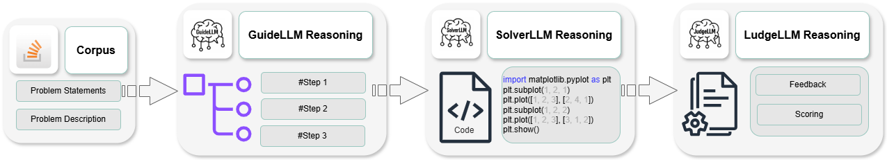

# RefactorCoderQA: Benchmarking Large Language Models for Multi-Domain Coding Tasks

RefactorCoderQA is a comprehensive benchmark designed to evaluate and enhance the performance of Large Language Models (LLMs) across multiple technical domains, including Software Engineering, Data Science, Machine Learning, and Natural Language Processing. The benchmark utilizes real-world coding challenges from Stack Overflow, structured to optimize model reasoning and problem-solving effectiveness.

## Key Features

- **Multi-Domain Coverage:** Diverse questions from SE, DS, ML, and NLP domains.
- **Real-World Data:** 2,635 authentic coding problems sourced directly from Stack Overflow.
- **Structured Prompting Framework:** Includes GuideLLM for task-specific guidance, SolverLLM for solution generation, and JudgeLLM for automated evaluation.
- **Balanced Dataset:** Evenly split into training, validation, and test sets.

## Dataset Structure

The dataset comprises:

- **Software Engineering** (677 questions): Python, C, Java, JavaScript.
- **Data Science** (827 questions): NumPy, Pandas, Matplotlib.
- **Machine Learning** (626 questions): TensorFlow, PyTorch, Scikit-learn, Cross-validation.
- **Natural Language Processing** (505 questions): Hugging Face, ChatGPT, Prompt Engineering.

## Model Architecture

RefactorCoderQA introduces a structured multi-agent prompting approach:

- **GuideLLM:** Provides explicit methodological steps.
- **SolverLLM:** Generates accurate, executable code.
- **JudgeLLM:** Performs automated solution evaluations, ensuring correctness, clarity, and efficiency.

### Agentic Workflow Framework Overview


*Figure 3: Overview of the RefactorCoderQA Agentic Workflow: A multi-agent framework that processes coding-related problem
statements through three coordinated stages, GuideLLM for structured methodology generation, SolverLLM for executable
code synthesis, and JudgeLLM for automated performance evaluation across accuracy, clarity, and efficiency dimensions.*

## Benchmark Results

The fine-tuned model, **RefactorCoder-MoE**, achieves state-of-the-art accuracy (76.84%) and consistently outperforms existing open-source and closed-source baselines across all technical domains.

### Performance Comparison (Table 1)

| **Model**                      | **SEQA** | **NLPQA** | **MLQA** | **DSQA** | **Overall** |
|--------------------------------|----------|-----------|----------|----------|-------------|
| **Closed-Source Models**       |          |           |          |          |             |
| GPT-4o Turbo                   | 73.02    | 63.93     | 80.95    | 74.67    | 70.23       |
| GPT-3.5 Turbo                  | 57.14    | 59.02     | 65.08    | 50.67    | 53.82       |
| Claude 3.5 Opus                | 65.44    | 56.33     | 69.04    | 53.55    | 57.88       |
| Gemini 1.5 Pro                 | 59.55    | 58.77     | 67.43    | 54.86    | 56.89       |
| **Open-Source Models (Medium)**|          |           |          |          |             |
| DeepSeek-Coder-7B              | 31.75    | 24.59     | 28.57    | 41.33    | 30.53       |
| DeepSeek-Coder-6.7B            | 28.57    | 36.07     | 25.40    | 32.00    | 24.81       |
| DeepSeek-LLM-7B                | 20.60    | 14.75     | 20.63    | 29.33    | 22.14       |
| DeepSeek-R1-Distill-Qwen-7B    | 20.63    | 19.67     | 23.81    | 18.67    | 20.99       |
| DeepSeek-R1-Distill-Llama-8B   | 19.05    | 24.59     | 20.63    | 24.00    | 23.66       |
| CodeLlama-7B-HF                | 22.22    | 19.67     | 26.67    | 20.63    | 20.23       |
| Falcon-7B-Instruct             | 17.46    | 13.11     | 19.05    | 26.67    | 21.37       |
| Gemma-7B                       | 17.46    | 19.67     | 25.40    | 30.67    | 19.08       |
| Phi-2                          | 17.46    | 19.67     | 17.46    | 21.33    | 22.90       |
| Mistral-7B                     | 15.87    | 16.39     | 14.29    | 21.33    | 17.56       |
| StarCoder2-7B                  | 15.87    | 18.03     | 19.05    | 22.67    | 19.85       |
| **Open-Source Models (Small)** |          |           |          |          |             |
| DeepSeek-Coder-1.3B            | 22.22    | 16.39     | 23.81    | 34.67    | 22.52       |
| DeepSeek-R1-Distill-Qwen-1.5B  | 6.35     | 14.75     | 15.87    | 14.67    | 13.36       |
| LLaMA-3.2-3B                   | 14.29    | 14.75     | 12.70    | 24.00    | 16.41       |
| Gemma-2B                       | 17.46    | 14.75     | 15.87    | 26.67    | 19.85       |
| StarCoder2-3B                  | 15.87    | 18.03     | 15.87    | 18.67    | 16.41       |
| **Fine-Tuned Model**           |          |           |          |          |             |
| RefactorCoder-MoE (Ours)       | **74.68**| **75.70** | **83.01**| **77.32**| **76.84**   |

*Table 1: Accuracy (%) of models on RefactorCoderQA benchmark across multiple technical domains.*

## Getting Started

To utilize RefactorCoderQA:

1. **Clone the repository:**
```bash
git clone <https://github.com/sadirahman/RefactorCoderQA.git>
```

2. **Navigate to the project directory:**
```bash
cd RefactorCoderQA
```

3. **Install dependencies:**
```bash
pip install -r requirements.txt
```

4. **Follow instructions** to deploy GuideLLM, SolverLLM, and JudgeLLM in your environment.

## Requirements

- Python 3.8 or higher
- Transformers (Hugging Face)
- PEFT (for QLoRA fine-tuning)


## Citation

If you use RefactorCoderQA, please cite our work:

```bibtex
@article{rahman2025refactorcoderqa,
  title={RefactorCoderQA: Benchmarking Large Language Models for Multi-Domain Coding Question Solutions},
  author={Shadikur Rahman, Aroosa Hameed, Gautam Srivastava, Syed Muhammad Danish},
  year={2025}
}
```
